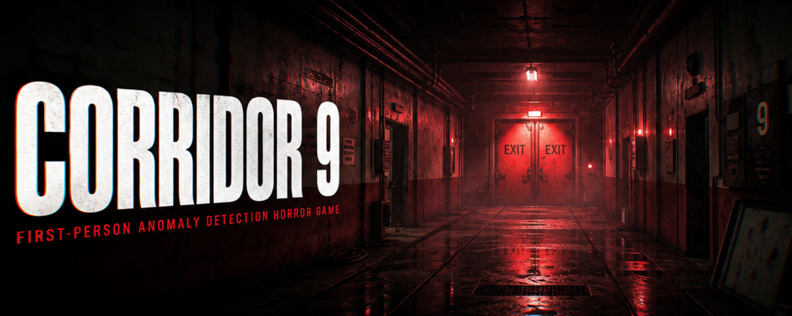

Corridor 9
A First-Person Anomaly Detection Horror Game

You are trapped in a facility with 25 sub-levels. Each 
  corridor looks normal — but anomalies hide in plain sight.
  A door that's the wrong color. A picture that's been 
  swapped. A hallway that stretches impossibly long. An 
  EXIT sign that's gone dark.

  Your job: walk to the end of each corridor, observe 
  carefully, and decide. If you spotted something wrong, 
  exit LEFT. If everything is normal, exit RIGHT.

  One wrong choice and the facility's defenses activate — 
  and you won't like what comes for you.

  FEATURES:
  • 25 procedurally generated corridors with unique layouts
  • 8 different anomaly types: wrong door colors, swapped
    pictures, impossibly long hallways, broken EXIT signs,
    ajar doors, flickering lights, blood stains on walls,
    and heavy rain
  • Immersive 3D sound design with procedural audio
    (footsteps, heartbeats, environmental creaks, rain, 
    thunder, monster roars)
  • Dynamic monster attack sequences with 6 unique patterns
    (burst, stalk, slam, phase, ceiling drop, entrance ambush)
  • Tension system that escalates as you descend deeper
  • Victory escape animation with door opening + blinding light
  • Atmospheric horror visuals with vignette, chromatic 
    aberration, and screen shake effects
